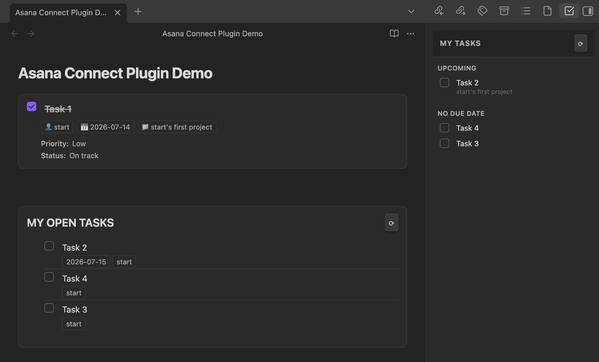
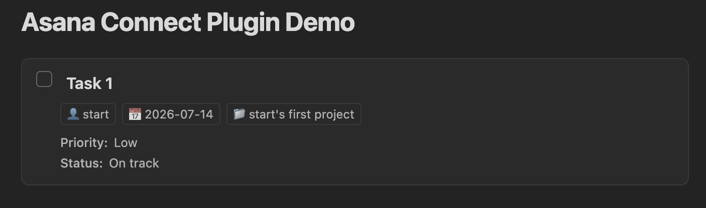
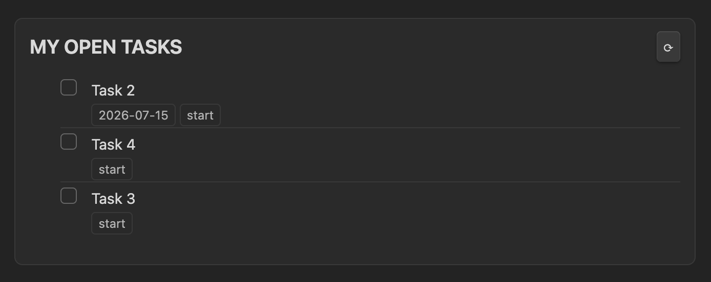
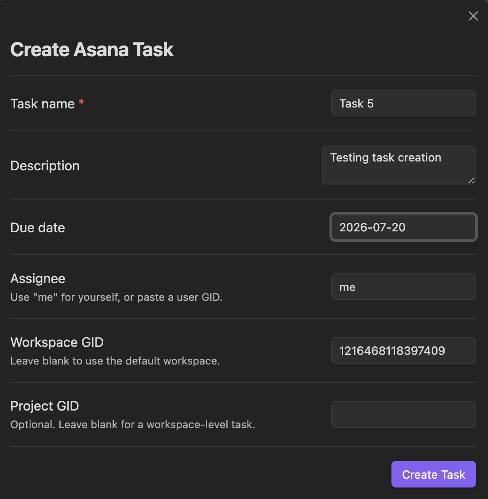
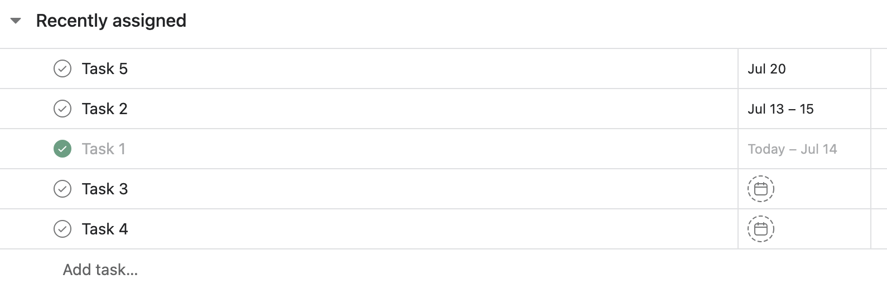

# Asana Connect

Embed, create, search, and sync Asana tasks directly inside Obsidian. Works with any Asana workspace or project.



## Setup

1. Go to Settings → Asana.
2. Paste your Personal Access Token (create one at Asana Account Settings → Apps → Personal Access Tokens).
3. Click Connect — it will verify your token and auto-fill your default workspace GID.
4. Optionally set a Default project GID if your team mostly works in one project.

Your PAT is stored locally in Obsidian's encrypted plugin data store and never leaves your machine.

## Features

### 1. Task embed (single task)

Paste a task GID or full Asana URL in a fenced code block:

````
```asana-task
1234567890
```
````

or

````
```asana-task
https://app.asana.com/0/project/1234567890/f
```
````

Renders: task name, checkbox (click to complete/reopen), assignee, due date (red if overdue), project, description, and custom fields.

| Task connected in Obsidian from Asana                               |
| ------------------------------------------------------------------- |
|  |

### 2. Task list block

Embed a live list of tasks filtered by various options:

````
```asana-tasks
mode: my-tasks
title: "My Open Tasks"
limit: 15
show-completed: false
```
````

Or show all tasks in a specific project:

````
```asana-tasks
mode: project
project: 987654321
title: "Sprint Tasks"
workspace: 111222333
show-completed: true
limit: 50
```
````

**Options:**

| Key | Values | Default |
|---|---|---|
| `mode` | `my-tasks` / `project` | `my-tasks` |
| `project` | project GID | — |
| `workspace` | workspace GID | settings default |
| `limit` | number | 100 |
| `show-completed` | `true` / `false` | settings default |
| `title` | any string | `"My Tasks"` / `"Project Tasks"` |

| Asana list block                                                                                                         |
| ------------------------------------------------------------------------------------------------------------------------ |
|  |


### 3. My Tasks sidebar

Click the checkmark ribbon icon or run `Asana: Open My Tasks sidebar` from the command palette.

Tasks are grouped into: Overdue, Today, Upcoming, No due date. Check any checkbox to mark complete directly in the sidebar.

Auto-refreshes on a configurable interval (default 5 min).

### 4. Create tasks

Command palette → `Asana Connect: Create Asana task`

A modal with: name, description, due date, assignee, workspace GID, project GID.

**Create from selected text:** select text in a note → command palette → `Asana: Create Asana task from selection and insert link`. Creates the task pre-filled with the selection and inserts a markdown link back into the note.

| Create Task in Obsidian                                                                                                        |
| ------------------------------------------------------------------------------------------------------------------------------ |
|  |

The task created above shows up in Asana immediately — no extra sync step:

| Task created in Asana from Obsidian                                                                    |
| ------------------------------------------------------------------------------------------------------ |
|  |

### 5. Search and insert

`Asana Connect: Search Asana tasks and insert link` — fuzzy search your tasks, inserts `[Task Name](url)` at cursor.

`Asana: Search Asana tasks and embed block` — same search, inserts an `asana-task` code block instead.

Live search fires after 2+ characters with 400ms debounce.

### 6. Note ↔ task linking (frontmatter)

**Link this note to an Asana task** — search your tasks and select one. Writes to the note's frontmatter:

```yaml
---
asana-task-gid: "1234567890"
asana-task-url: "https://app.asana.com/0/..."
asana-task-name: "My task"
---
```

**Sync linked task status** — pulls the latest task state (name, completed, due date, assignee) into frontmatter.

**Complete linked Asana task** — marks the linked task complete in Asana from inside Obsidian.

## Finding GIDs

- **Workspace GID:** open any Asana page → the first number after `asana.com/0/` in the URL, or go to Settings → connect in the plugin which auto-detects it.
- **Project GID:** open the project in Asana → the number in the URL (`asana.com/0/<workspace>/<project_gid>/...`).
- **Task GID:** open the task detail view → the last number in the URL.

## Development

```bash
npm run dev    # watch mode with source maps
npm run build  # production bundle
```

## License

MIT — see LICENSE.
